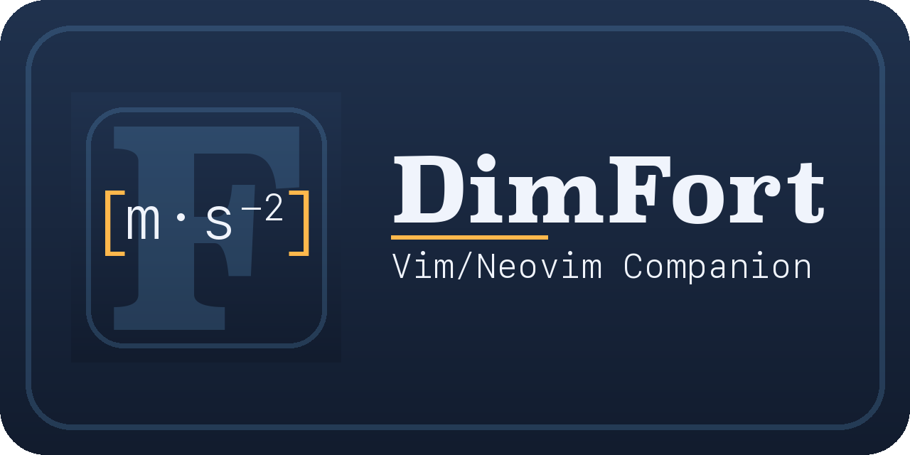

# DimFort — Neovim companion



Neovim companion for [DimFort](https://github.com/ArrialVictor/DimFort) —
the dimensional-homogeneity checker for Fortran. Thin LSP client +
user commands; the heavy lifting is done by the `dimfort lsp` server.

> **Neovim-only.** The plugin uses Neovim's built-in `vim.lsp.*` Lua
> APIs, which classic Vim doesn't share. Classic Vim users can still
> talk to `dimfort lsp` via a third-party LSP client like
> [`vim-lsp`](https://github.com/prabirshrestha/vim-lsp) or
> [`coc.nvim`](https://github.com/neoclide/coc.nvim) — the server is
> editor-agnostic — but the per-feature toggle commands and inlay
> rendering polish below are Neovim-only.

## Requirements

- Neovim ≥ 0.11 (uses `vim.lsp.start` and `vim.fs.find`).
- DimFort installed and `dimfort lsp` reachable from `$PATH` (or pass
  an absolute path via the `executable` option). Install instructions:
  https://github.com/ArrialVictor/DimFort.

## Installation

### lazy.nvim

```lua
{
  "ArrialVictor/DimFort-NvimCompanion",
  ft = "fortran",
  opts = {
    -- Override the executable if `dimfort` isn't on $PATH.
    -- executable = "/path/to/.venv/bin/dimfort",
  },
}
```

### packer.nvim

```lua
use {
  "ArrialVictor/DimFort-NvimCompanion",
  ft = "fortran",
  config = function()
    require("dimfort").setup({})
  end,
}
```

### Manual

Clone into your `runtimepath`:

```bash
git clone https://github.com/ArrialVictor/DimFort-NvimCompanion.git \
  ~/.local/share/nvim/site/pack/dimfort/start/DimFort-NvimCompanion
```

Then add to your `init.lua`:

```lua
require("dimfort").setup({})
```

## Configuration

All options shown with their defaults:

```lua
require("dimfort").setup({
  executable = "dimfort",                       -- path to the dimfort binary

  -- Feature toggles. Each maps to a server initializationOption.
  -- Default stance: the side panel and a short hover are the unit
  -- surfaces, so inlay hints are OFF (redundant beside them).
  inlay_hints_enabled = false,
  completion_enabled = true,
  code_actions_enabled = true,
  goto_definition_enabled = true,

  -- Hover verbosity. "short" = compact `name : unit` (the default);
  -- "detailed" = full unit-algebra tree; "disabled" = no hover. The
  -- panel is unaffected.
  -- See https://github.com/ArrialVictor/DimFort/blob/main/docs/hover-ui.md
  hover = "short",                              -- "disabled" | "short" | "detailed"

  -- Scale/magnitude checking (S001 multiplicative, S002 affine-offset).
  -- "auto" defers to the project .dimfort.toml [scale] enabled;
  -- "on"/"off" override it. Cycle with :DimFortCycleScale.
  scale_mode = "auto",                          -- "auto" | "on" | "off"

  -- Content-hash cache (https://github.com/ArrialVictor/DimFort/blob/main/docs/usage.md#content-hash-cache).
  cache_mode = "read-write",                    -- "off" | "read-only" | "read-write"
  cache_dir  = "",                              -- "" = .dimfort-cache/ under workspace root

  -- Side panel (on by default; :DimFortTogglePanel to close).
  panel_enabled        = true,
  panel_layout         = "both",                -- "both" | "expression" | "routine"
  panel_position       = "right",               -- "right" | "left" | "bottom"
  panel_width_fraction = 0.35,                  -- fraction of editor width
  panel_width_cols     = nil,                   -- explicit cols; wins over fraction
  panel_debounce_ms    = 200,                   -- cursor-follow debounce

  -- Workspace plumbing.
  max_workset_size = 40,                        -- cap on workset size
  external_modules = {},                        -- modules treated as known-out-of-workset
  filetypes        = { "fortran" },             -- buffers DimFort attaches to
  root_markers     = { ".dimfort.toml", ".git" },
  auto_attach      = true,                      -- attach via FileType autocmd
})
```

If `auto_attach = false`, call `require("dimfort").attach()` manually
from your own autocommand or keymap.

## Commands

| Command                                  | Effect                                                              |
|------------------------------------------|---------------------------------------------------------------------|
| `:DimFortCheckWorkspace`                 | Run the workspace-wide unit check.                                  |
| `:DimFortRestart`                        | Restart the language server.                                        |
| `:DimFortStatus`                         | Print current feature toggles and client id.                        |
| `:DimFortToggleInlayHints`               | Toggle inlay hints; restarts the server.                            |
| `:DimFortToggleCompletion`               | Toggle unit-name completion; restarts the server.                   |
| `:DimFortToggleCodeActions`              | Toggle code actions; restarts the server.                           |
| `:DimFortToggleGotoDefinition`           | Toggle go-to-definition; restarts the server.                       |
| `:DimFortCycleHover`                     | Cycle hover verbosity (disabled → short → detailed); restarts.      |
| `:DimFortToggleCache`                    | Toggle content-hash cache between `off` and `read-write`.           |
| `:DimFortCycleScale`                     | Cycle scale checking (`auto` → `on` → `off`); `auto` defers to `.dimfort.toml`. |
| `:DimFortTogglePanel`                    | Open / close the side panel.                                        |
| `:DimFortPanelLayout {both\|expression\|routine}` | Switch which panel sections are shown.                     |
| `:DimFortPanelRefresh`                   | Force a panel refresh (debugging).                                  |
| `:DimFortScopeFilter [query]`            | Filter the panel's Scope section by name/unit (no argument clears). |
| `:DimFortImportsFilter [query]`          | Filter the panel's Imports section by name/unit/module (no argument clears). |

## Side panel

`:DimFortTogglePanel` opens a persistent split (right by default) that
follows the cursor. At full feature parity with the VSCode companion, it
shows six stacked sections (the volatile middle three appear in the
`both` layout):

- **Expression** — the unit-algebra tree for the expression under the
  cursor: each node with its resolved unit, the rule that produced it,
  and a 🟢 / 🟡 / 🔴 marker, columns aligned. Same content as the
  Detailed hover, but it stays visible while you edit — handy for
  debugging a mismatch or talking through code with someone.
- **Diagnostics** — DimFort diagnostics on the cursor line, with the
  🔴 / 🟡 / 🔵 severity-circle vocabulary (info-level diagnostics such as
  P001 unparsed regions read the same as the rest).
- **Interactions** — cross-site unit constraints for the symbol under
  the cursor (the `dimfort interactions` query): the X001 conflict, if
  any, then the Declaration / Write / Read / Undetermined-read groups,
  each site showing its location, unit, and source snippet.
- **Actions** — the code actions available at the cursor (Add `@unit{}`
  / extract literal to a PARAMETER); press `<CR>` on one to apply it.
- **Scope** — the declarations of every *enclosing* scope, stacked
  outermost-first and indented by nesting (a module's declarations,
  then a contained subroutine's locals). Each variable is marked 🟢
  (annotated), 🟡 (unannotated), or 🔴 (unparseable annotation), so gaps
  in your annotation coverage jump out. `:DimFortScopeFilter <query>`
  narrows the list to variables whose name or unit matches.
- **Imports** — variables and procedures a `use` clause brings into scope
  (usable here but declared elsewhere), grouped by source module under a
  `from <module>` header (functions read as `name(argunits)`, showing
  their argument + return units, e.g. `force(kg)`). Rows navigate cross-file to where the imported symbol — and
  its `@unit{}` — is declared. `:DimFortImportsFilter` narrows it.

Press `<CR>` on any declaration, diagnostic, interaction-site, or import
row to jump to it (cross-file for interaction sites and imports); the
file-wide diagnostic counts pin the footer.

On by default (opens on attach); set `panel_enabled = false` to keep it
closed and open it on demand with the toggle command. Width is fixed
(the source window absorbs resize), set via `panel_width_cols` or
`panel_width_fraction`.

<picture>
  <source media="(prefers-color-scheme: dark)" srcset="https://raw.githubusercontent.com/ArrialVictor/DimFort/main/docs/img/panel-nvim-hero_dark.png">
  
</picture>

<picture>
  <source media="(prefers-color-scheme: dark)" srcset="https://raw.githubusercontent.com/ArrialVictor/DimFort/main/docs/img/panel-nvim-mismatch_dark.png">
  
</picture>

## What you get

Same surface as the VSCode companion:

- Diagnostics (H001–H004, U001/U002/U005–U007/U010, …) per file in the
  loclist / quickfix / `vim.diagnostic` panel.
- Hover (`K`) for variable units.
- Inlay hints, go-to-definition, completion, code actions (toggleable).
- The cursor-following **side panel** above.
- Workspace-wide cross-file checks driven from `use` clauses.

## Notes

- Inlay hints render automatically once the plugin attaches — no need
  to call `vim.lsp.inlay_hint.enable` manually. The `LspAttach`
  handler enables them whenever the server flag is on and disables
  them otherwise, so `:DimFortToggleInlayHints` does the right thing
  both client- and server-side.
- `dimfort.insertSnippet` (used by the "add `@unit{}`" code action)
  inserts the snippet literally and places the cursor at the `$0`
  position; Neovim doesn't have full LSP snippet expansion built in,
  so tab-stops `${1:placeholder}` are flattened to their default text.
- `dimfort.extractToParameter` (used by the H010 D1.5 "Extract literal
  to PARAMETER" quick-fix) prompts via `vim.ui.input` — plug in
  `dressing.nvim` or `snacks.nvim` for a nicer prompt UI than the
  builtin one.

## License

MIT.
